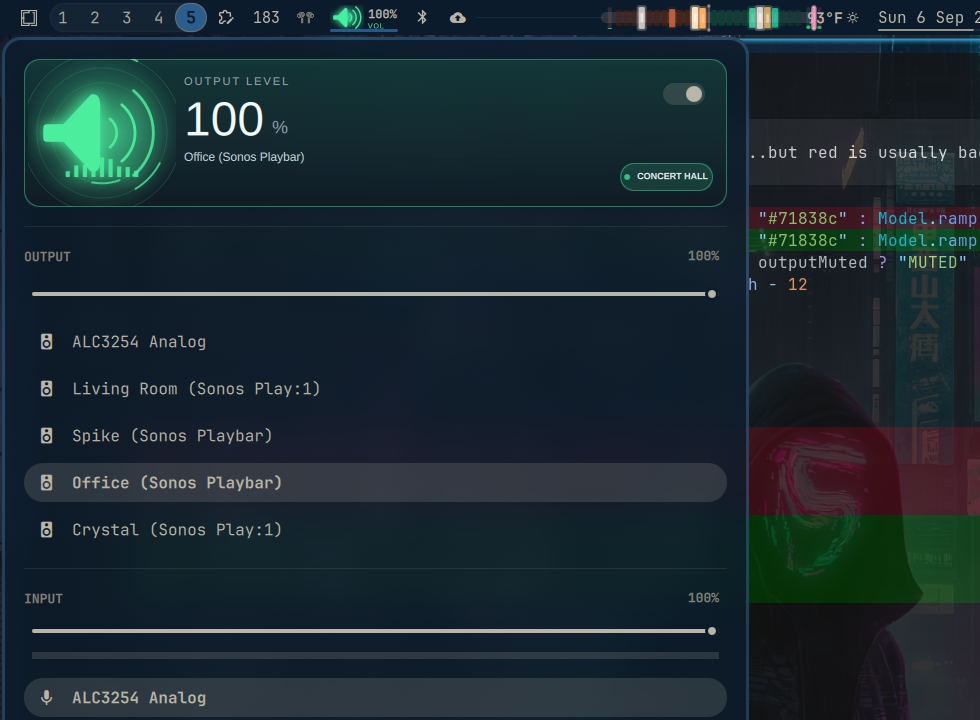

<p align="center">
  
</p>

<p align="center">
  <a href="#install"></a>
  <a href="LICENSE"></a>
  <a href="https://github.com/nixfred/ram.plugin.omarchy"></a>
</p>

# Audio Pulse

An animated speaker for the Omarchy top bar. Same Pulse colour language as [RAM Pulse](https://github.com/nixfred/ram.plugin.omarchy), [CPU Pulse](https://github.com/nixfred/omacpu) and [Net Pulse](https://github.com/nixfred/omanet.plugin.omarchy), mapped to loudness: green at full volume, yellow at half, muted grey. 100% is alive, not an alarm.

<p align="center">
  
</p>

The mark follows the selected sink: speaker cone, headphone cups, HDMI display, or extra wireless arcs. Sound rings and a waveform track volume.

In the bar the mark and the volume share one widget: the mark keeps the left lane, the digits the right, and neither is drawn over the other. That is roughly half the width of the old chip-plus-two-line-column layout, and both stay readable against every theme tint. Mute is still the slash, and the output name stays in the tooltip.

Left-click opens the mixer. Right-click mutes. Scroll changes volume. Everything else — output picker, input meter, per-app streams, keyboard cursor — is the stock audio panel, deliberately preserved.

<p align="center">
  
</p>

## Install

This is a clone of `omarchy.audio`. On an Omarchy desktop:

```bash
omarchy plugin clone omarchy.audio
```

Then copy this plugin over `~/.config/omarchy/plugins/<user>.audio`, or:

```bash
omarchy plugin add https://github.com/nixfred/audio.pulse.omarchy --enable
```

Clone already replaces `omarchy.audio` in place. Disable the stock panel if both claim the bar slot.

## Files

- `AudioChip.qml` — compact bar speaker and the 148px hero
- `Panel.qml` — mixer, cloned from stock audio
- `Model.js` — sink kind, loudness ramp, volume readout
